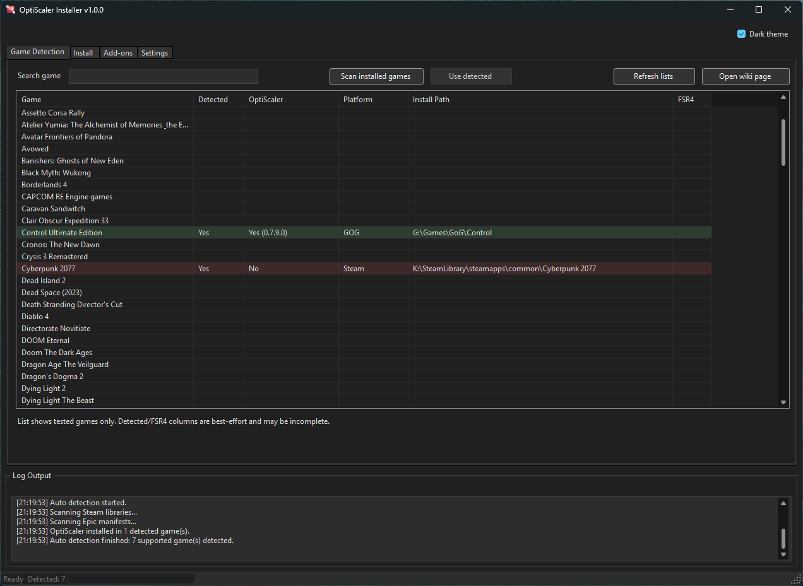
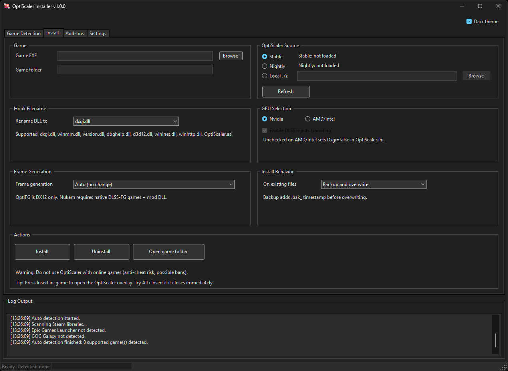
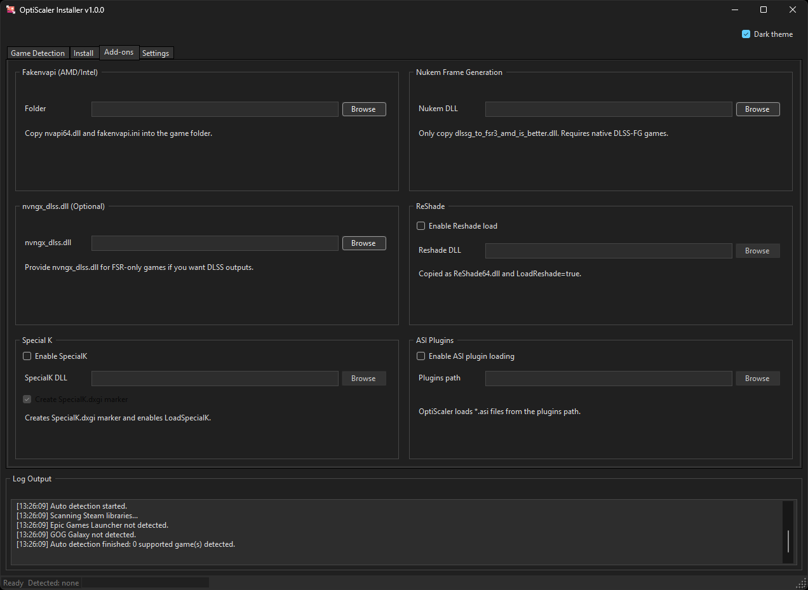
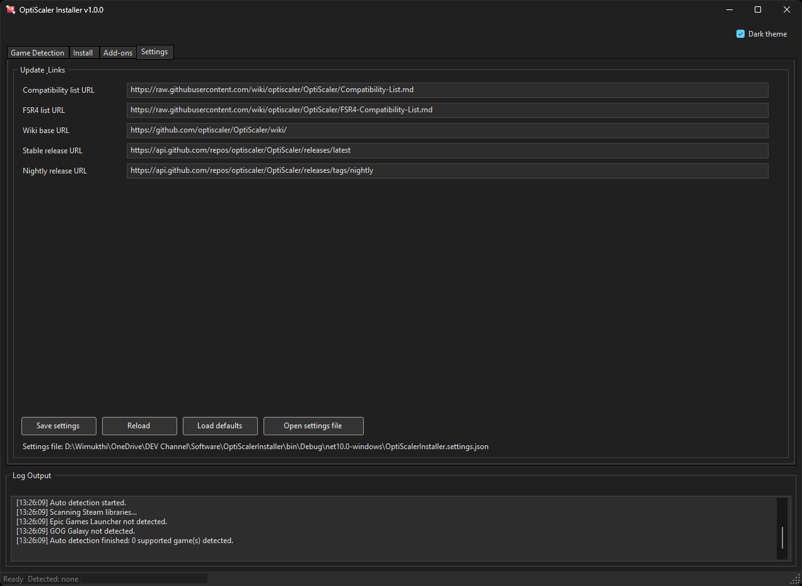

# OptiScaler Installer

WinForms installer and manager for OptiScaler that supports automatic game detection, per-game configuration, and add-on integration.

## Features

- Auto-detect supported games (Steam, Epic, GOG) and prefill install settings.
- Compatibility list view with detection and FSR4 indicators.
- Install from stable, nightly, or local OptiScaler archive (.7z).
- GPU vendor settings and OptiFG/Nukem frame generation options.
- Add-ons: Fakenvapi, Nukem FG DLL, nvngx_dlss.dll, ReShade, Special K, ASI plugins.
- Configurable URLs for lists and releases.

## Requirements

- Windows 10/11
- .NET 10 SDK (for building)
- Visual Studio 2022/2026 with WinForms workload (optional)

## Quick Start

Build:

```
dotnet build .\OptiScalerInstaller.sln
```

Run (Debug):

```
.\bin\Debug\net10.0-windows\OptiScalerInstaller.exe
```

## Usage

### Game Detection tab

- Search/filter the compatibility list.
- Click "Scan installed games" to detect Steam/Epic/GOG installs.
- Double-click a detected entry or use "Use detected" to prefill the Install tab.

### Install tab

- Select the game EXE or folder.
- Choose OptiScaler source (stable/nightly/local .7z).
- Set hook DLL name, GPU vendor, and frame generation mode.
- Install or uninstall using the Actions section.

### Add-ons tab

- Provide paths for Fakenvapi, Nukem FG, nvngx_dlss.dll, ReShade, Special K, and ASI plugins.
- Enable only what your game needs.

### Settings tab

- Update list URLs and release endpoints.
- Save, reload, or load defaults.
- Open the settings file directly from the UI.

## Configuration

Settings are stored next to the executable:

- `OptiScalerInstaller.settings.json`

You can edit this file manually or use the Settings tab.

## Versioning

Build version auto-increments on each build using `BuildVersion.txt`:

- Build increments every build
- Minor increments every 100 builds
- Major increments every 10 minor increments

The window title shows the current version as `vMajor.Minor.Build`.

## Screenshots

Game Detection:



Install:



Add-ons:



Settings:



## Notes

- Do not use OptiScaler with online games (anti-cheat risk, possible bans).
- Detection and FSR4 indicators are best-effort based on the wiki lists.

## Credits

- OptiScaler: https://github.com/optiscaler/OptiScaler
