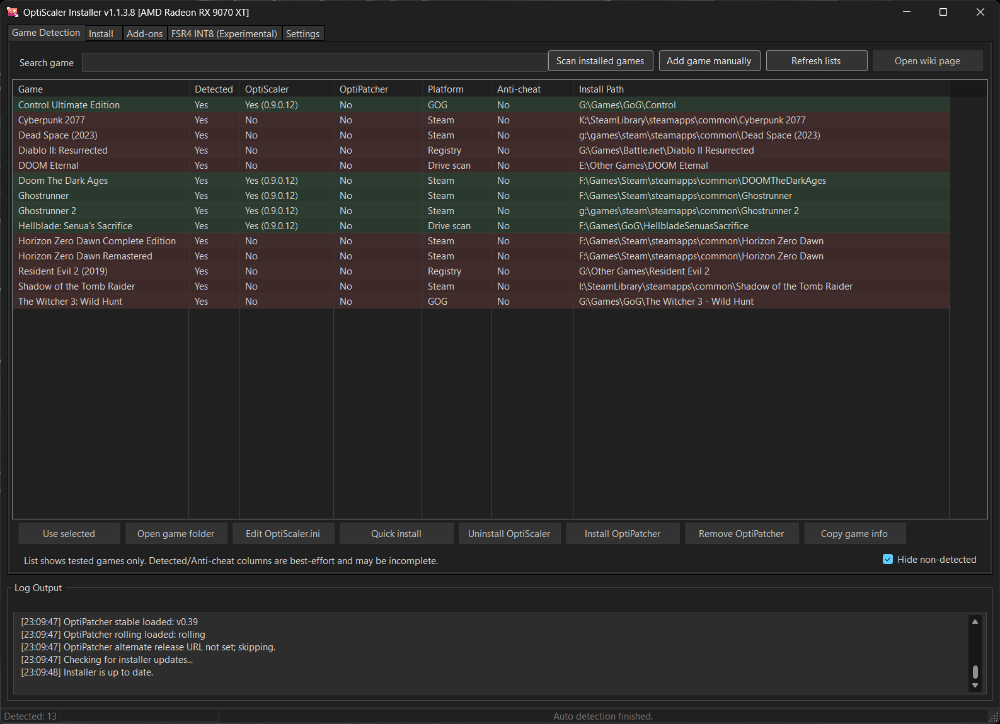
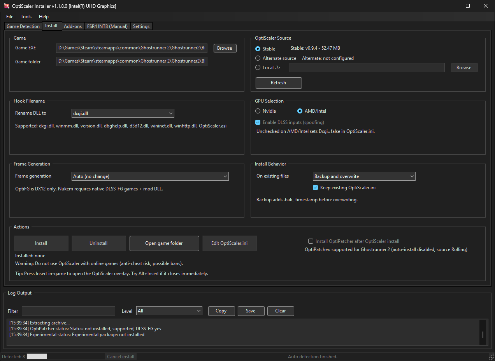
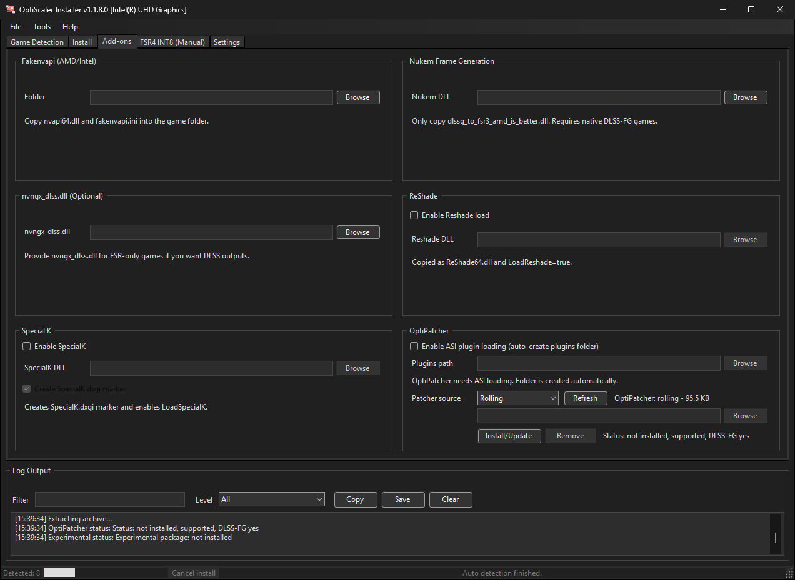
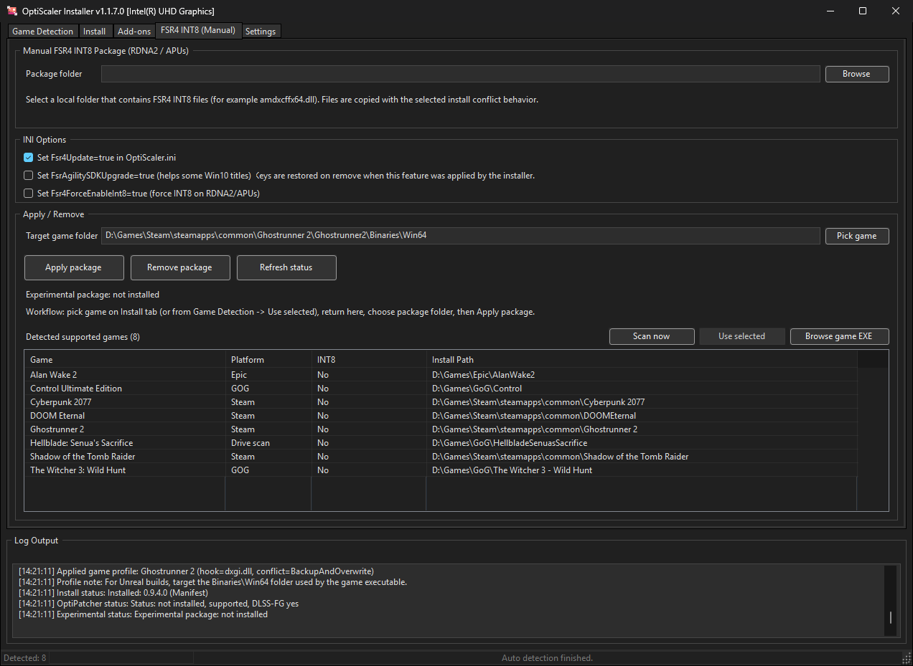
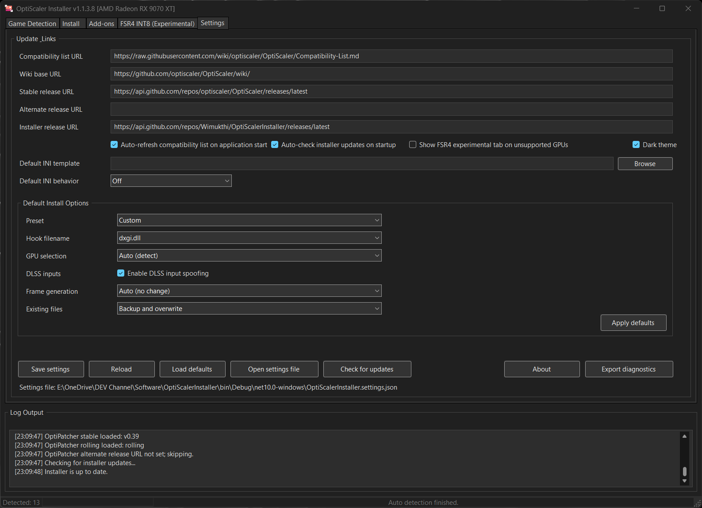
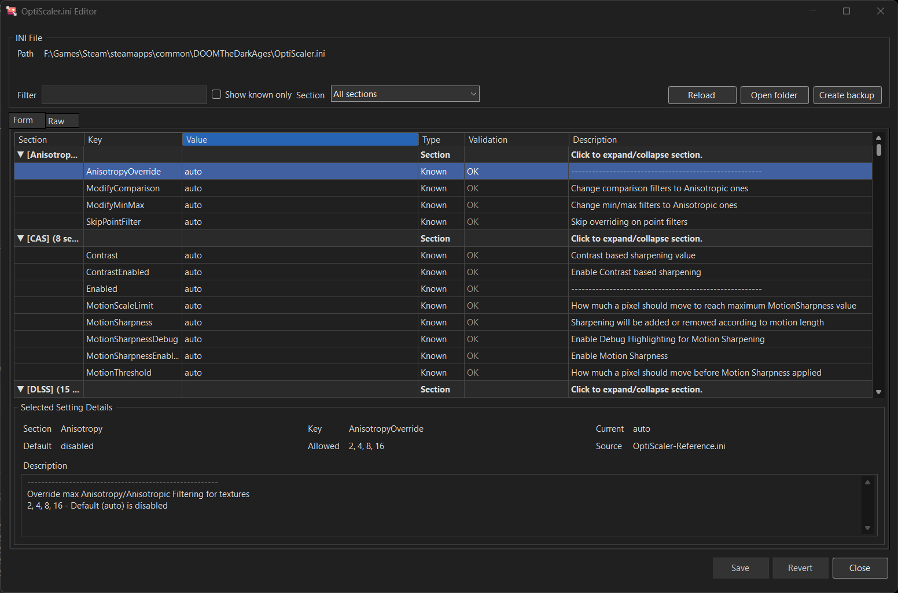

# OptiScaler Installer

WinForms installer and manager for OptiScaler that supports automatic game detection, per-game configuration, and add-on integration.

## Features

- Auto-detect supported games (Steam, Epic, GOG, EA App, Ubisoft Connect, registry) with deep-scan augmentation and prefill install settings.
- Manual game add flow: pick a game executable to force-match and persist supported installs that automated scans miss.
- Compatibility list view with detection plus both OptiScaler and OptiPatcher install status/version.
- Inline update visibility on Game Detection for installed OptiScaler/OptiPatcher (shows installed vs latest when newer releases are available).
- Optional `Hide non-detected` filter to focus only on detected installs.
- Install from stable, alternate release source, or local OptiScaler archive (.7z).
- GPU vendor settings and OptiFG/Nukem frame generation options.
- Add-ons: Fakenvapi, Nukem FG DLL, nvngx_dlss.dll, ReShade, Special K, ASI plugins.
- OptiPatcher integration with rolling/stable/alternate/local source selection, supported-game enforcement, manual install/remove, and manifest-aware detection.
- One-click Install-tab OptiPatcher flow (`Install OptiPatcher after OptiScaler install`) with install summary and preflight validation.
- Integrated OptiScaler INI editor with grouped form view, raw view, validation, filtering, and backup/save/revert workflow.
- Global OptiScaler.ini defaults (merge or replace) during install.
- Default install option presets (hook, GPU, DLSS inputs, frame generation, conflict mode).
- Detect existing OptiScaler installs and offer update/reinstall/uninstall.
- Compatibility refresh diff tracking (+added/-removed/~changed) with row highlighting.
- Compatibility parser validation with JSON-feed support, Markdown fallback, and live-list release canary.
- Per-game workaround template auto-apply on detected game selection.
- Version-aware add-on behavior for newer OptiScaler builds (0.9+ bundled component handling).
- Post-install verification report with INI and file checks.
- Archive provenance metadata (source URL, size, SHA-256 fingerprint) in install manifest/log.
- Built-in installer update checker with optional startup auto-check and non-intrusive in-app notice.
- Diagnostics export bundle (logs, settings, detection snapshot).
- Configurable URLs for lists and releases.
- Anti-cheat signature hints in detection results with install-time warning prompts.
- Startup compatibility auto-refresh toggle.
- FSR4 INT8 (Experimental) workflow with detected-game picker and optional visibility override on unsupported GPUs.
- Robust GPU detection using adapter vendor IDs (with fallbacks), and detected GPU model shown on the title bar.

## Requirements

- Windows 10/11
- .NET 10 SDK (for building)
- Visual Studio 2022/2026 with WinForms workload (optional)

## Quick Start

Build:

```
dotnet build .\OptiScalerInstaller.sln
```

Run (Debug):

```
.\bin\Debug\net10.0-windows\OptiScalerInstaller.exe
```

Create release package (clean + staged zip):

```
powershell -ExecutionPolicy Bypass -File .\scripts\BuildReleasePackage.ps1
```

Run compatibility parser fixtures and live-list canary:

```
powershell -ExecutionPolicy Bypass -File .\scripts\TestCompatibilityParser.ps1 -Live
```

## Usage

### Game Detection tab

- Search/filter the compatibility list.
- Click "Scan installed games" to run the unified detection pipeline (launcher/registry scan + deep scan augmentation). The app prompts you to choose drives before deep scan starts.
- Click "Add game manually" to browse to a game executable and persist a supported manual detection.
- Enable "Hide non-detected" to show only rows that are currently detected.
- OptiScaler/OptiPatcher columns also show update state for detected installed games (example: `Yes (0.9.0 -> v0.9.1)`).
- Double-click a detected entry or use "Use detected" to prefill the Install tab.
- Right-click a detected row for shortcuts (use selected, open folder, edit INI, quick install/uninstall, OptiPatcher actions, wiki, copy info).

### Install tab

- Select the game EXE or folder.
- Choose OptiScaler source (stable/alternate/local .7z).
- Set hook DLL name, GPU vendor, and frame generation mode.
- Optionally enable `Install OptiPatcher after OptiScaler install` for supported detected games.
- Install or uninstall using the Actions section.

### Add-ons tab

- Provide paths for Fakenvapi, Nukem FG, nvngx_dlss.dll, ReShade, Special K, and ASI plugins.
- Configure advanced OptiPatcher source options (rolling/stable/alternate/local .asi) and manual install/remove.
- Enable only what your game needs.

### FSR4 INT8 (Experimental) tab

- Apply/remove the INT8 package to a selected game folder.
- Pick targets from detected supported games or browse manually to a game EXE.
- Optional INI toggles (`Fsr4Update`, `FsrAgilitySDKUpgrade`) are applied/restored by installer-managed state.

### Settings tab

- Update list URLs and release endpoints.
- Configure installer update URL.
- Optional component feed URL can be set in `OptiScalerInstaller.settings.json` (`ComponentReleaseUrl`).
- Set default OptiScaler.ini template and behavior.
- Configure default install options and apply them to the Install tab.
- Export diagnostics bundles for support/debugging.
- Save, reload, or load defaults.
- Open the settings file directly from the UI.

### INI Editor

- Open from Install tab (`Edit OptiScaler.ini`) or from the Game Detection context menu.
- Form view groups keys by INI section with known-setting descriptions and validation hints.
- Raw view supports direct text editing when needed.
- Includes reload, backup, revert, and save operations.

## Configuration

Settings are stored next to the executable:

- `OptiScalerInstaller.settings.json`

You can edit this file manually or use the Settings tab.

## Versioning

Build version auto-increments on each build using `BuildVersion.txt` and is emitted as `vMajor.Minor.Patch.Build`:

- Build increments every build
- Patch increments every 10 builds
- Minor increments every 100 builds
- Major increments every 1000 builds (base major starts at 1)

The window title shows `vMajor.Minor.Patch.Build` and, when detected, the active GPU model.

## Screenshots

Game Detection:



Install:



Add-ons:



FSR4 INT8 (Experimental):



Settings:



INI Editor:



## Version History

- v1.1.6.0 - Add a keep-existing-`OptiScaler.ini` option for updates/reinstalls, parse the full official compatibility list including plain table rows, add JSON compatibility feed support with parser diagnostics/cache validation, and gate release packaging with compatibility parser fixtures plus a live official-list canary.
- v1.1.5.9 - Fix Markdown wiki-link parsing for compatibility entries whose game names or page slugs contain parentheses, preventing truncated wiki URLs such as `Dead-Space-(2023`.
- v1.1.5.8 - Improve INI editor responsiveness and keyboard shortcuts, and render updater release notes as themed rich text with Markdown headings, lists, code formatting, and clickable links.
- v1.1.5.7 - Harden deep-scan detection against corrupt or unreadable folders by materializing file/folder enumeration inside exception handling and isolating per-drive scan failures so one bad directory no longer aborts the whole scan.
- v1.1.5.2 - Consolidate HTTP client across services to avoid socket exhaustion and add centralized retry, move WMI GPU detection off the UI thread for faster startup, debounce game-search and game-folder text inputs for snappier filtering, fix compatibility list parsing to handle the remote wiki table format and reject anchor/section-anchor cross-references, add cache-preservation guards that reject suspiciously-low parse counts on remote list refreshes, and broaden anti-cheat detection (deeper folder scan, tighter Riot Vanguard tokens to prevent false positives, EAC `start_protected_game` bootstrapper coverage, and PunkBuster signatures).
- v1.1.4.5 - Fix detected-game install hangs by removing UI-thread blocking during game-profile refresh, treat missing wiki profile pages (404) as non-fatal during profile fetch, and harden wiki profile URL path handling.
- v1.1.4.3 - Add local `GameProfiles.json` catalog + profile service integration, settings for profile catalog URL and startup profile refresh, and automatic profile-driven install-option application so detected game-specific defaults are applied from local profile data with offline-first behavior.
- v1.1.3.7 - Add full OptiScaler INI editor (form/raw modes, validation, section grouping/filter, descriptions/reference docs, backup/save/revert), expand Game Detection actions and quick-install flow, improve install/uninstall button-state gating, add OptiPatcher/INT8 detection status refinements, and harden Unreal-target preflight by auto-retargeting to `Binaries\Win64`/`WinGDK` when applicable.
- v1.1.1.1 - Drive selection is now always explicit for deep-scan augmentation: first-run one-time scan prompts for selected drives, and manual "Scan installed games" runs now prompt for drives instead of scanning all drives automatically.
- v1.1.0.9 - Merge launcher and deep scan into a single "Scan installed games" pipeline, repurpose the secondary button into "Add game manually" (EXE-based forced match + persistence), and improve install-state path selection/probing for nested DX11/DX12 binary folders.
- v1.1.0.5 - Align FSR INT8 detected-games list with the canonical Game Detection result set so counts and entries match (fixes duplicate/multi-path variants appearing only in the experimental list).
- v1.1.0.3 - Add one-time first-start deep scan across all available drives, make deep scan always augment launcher detection (never replace it), add uninstall-registry detection fallback for broader launcher coverage (including Battle.net-style installs), and de-duplicate FSR INT8 detected-game entries after merged scans.
- v1.1.0.1 - Generalize deep-scan game-name matching for edge-case installs by improving title tokenization (digits/apostrophes), adding ambiguity-safe relaxed prefix matching, and expanding executable probe paths (`x64_dx12`, `x64_dx11`, nested bin/binaries subfolders).
- v1.0.9.9 - Fix manual deep-scan root normalization so selected drives are scanned from true roots (for example `G:\`) instead of drive-relative current directories (for example installer folder on `G:`), preventing missed detections on launcher-independent installs.
- v1.0.9.7 - Add persistent deep-scan detected games cache and saved `Hide non-detected` preference, refresh OptiScaler/OptiPatcher install-state columns immediately after install/remove actions, add About -> Sponsors tab with automatic public sponsor loading, and streamline the Sponsors tab UI by removing extra helper/status text.
- v1.0.8.8 - Add async manual deep-drive scan with drive picker dialog (launcher-independent detection), remove custom scan-folder setting/UI, add `Hide non-detected` filter on Game Detection tab, and switch drive picker list to themed control to remove bright system borders.
- v1.0.8.2 - Add `Sponsor Me` link to About dialog (https://github.com/sponsors/Wimukthi) with themed link styling and direct open action.
- v1.0.8.0 - Fix OptiPatcher detection to use the same nested install probing behavior as OptiScaler, improve detected-game folder matching for nested binary paths, and harden release packaging with clean staged zip output (prevents stale top-level `win-x64` payloads).
- v1.0.7.6 - Add full OptiPatcher integration: support-list sync, release fetch (stable/rolling/alternate), install/remove services and manifests, detection column on Game Detection, supported-only enforcement, Install-tab `Install + OptiPatcher` guided flow with preflight + summary, and improved OptiPatcher panel layout/ASI folder auto-setup.
- v1.0.6.7 - Harden uninstall/remove safety with root-scoped manifest path validation, add archive extraction traversal guards, improve release asset selection and digest verification, add retry/timeout handling for release/compatibility/download fetches, tighten startup background error handling, and expand core code comments.
- v1.0.6.1 - Add FSR4 experimental tab visibility toggle for unsupported GPUs, fix runtime tab theming artifacts, harden GPU detection with vendor-ID matching, and show detected GPU model in the title bar.
- v1.0.5.2 - Harden OptiScaler detection and executable resolution (fewer false positives, stronger manifest validation, improved nested binary probing), add startup auto-update-check toggle, and include OptiScaler project link in About.
- v1.0.5.0 - Improve startup crash handling: fatal initialization errors now show an explicit dialog and terminate cleanly instead of silently running as a background process.
- v1.0.4.9 - Fix install-status detection for games that load from nested binary folders (for example `Binaries\\Win64`) so existing OptiScaler installs are correctly reported.
- v1.0.4.8 - Fix false-positive OptiScaler detection by requiring strong install markers or OptiScaler metadata before generic hook DLLs (like stock dbghelp.dll) are treated as installed.
- v1.0.4.7 - Add About dialog metadata view, anti-cheat detection/warnings, startup compatibility auto-refresh option, custom scan folder support, and settings/ui stabilization updates.
- v1.0.4.2 - Add compatibility diff/highlight, game workaround templates, stronger preflight validation, archive SHA provenance, and post-install verification reporting.
- v1.0.3.9 - Rename nightly to alternate source, skip checks when unset, and keep update notice aligned.
- v1.0.3.8 - Handle missing OptiScaler release URLs (404) without blocking other release data.
- v1.0.3.7 - Default install presets, diagnostics export, EA/Ubisoft detection, and updater rollback safety.
- v1.0.3.5 - Align Game Detection action buttons and update the update button label when a new version is available.
- v1.0.3.4 - Restore list view headers by correcting dock order in the Game Detection layout.
- v1.0.3.2 - Stabilize Game Detection header layout with layout panels and fix dock order.
- v1.0.2.8 - Fix Game Detection layout spacing, dock the header/footer, and persist dark theme by default.
- v1.0.1.7 - Versioning now auto-bumps patch/minor/major every 10/100/1000 builds.
- v1.0.0.16 - Silent release refresh/update check, error logging, and comment pass cleanup.
- v1.0.0.15 - Remove FSR4 compatibility detection and related settings/UI.
- v1.0.0.14 - Improve GPU auto-detection with WMI fallback and adapter logging.
- v1.0.0.13 - Auto-detect GPU vendor and fix FSR4 list parsing.
- v1.0.0.11 - Fix updater version comparison to respect build revision.
- v1.0.0.9 - Fix install root detection, add legacy uninstall fallback, and normalize detected paths.
- v1.0.0.6 - First public release: detection list install status, default INI support, installer updater, and install action prompts.

## Notes

- Do not use OptiScaler with online games (anti-cheat risk, possible bans).
- Detection indicators are best-effort based on the wiki lists.

## Credits

- OptiScaler: https://github.com/optiscaler/OptiScaler
