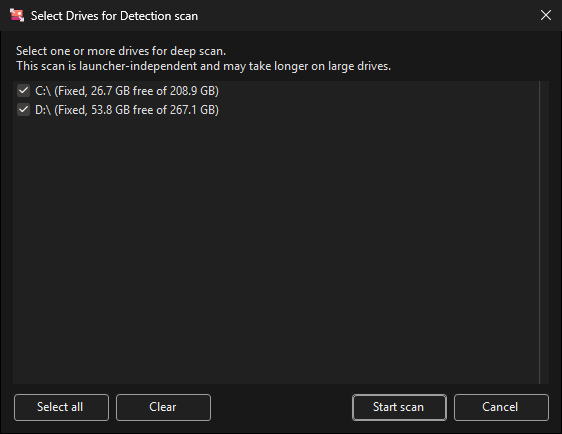
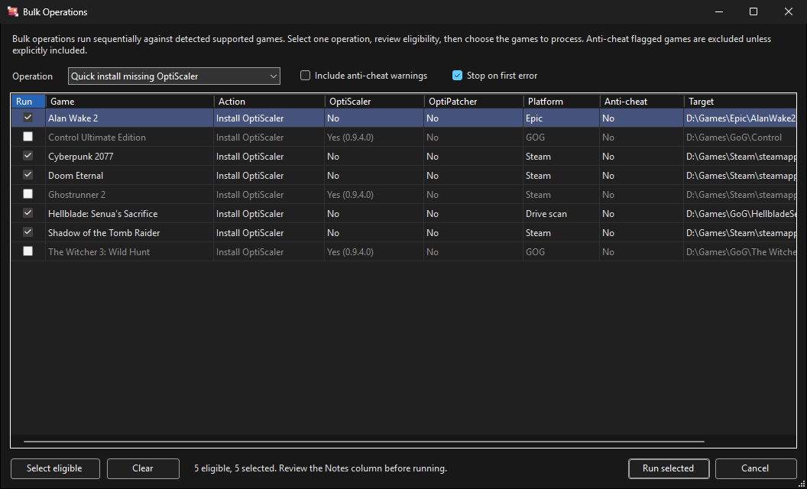

# Usage

A menu bar, five tabs, and a shared log pane at the bottom. Everything the app does is written to that log,
and the status bar shows the detected-game count, the current background operation, and a **Cancel** button
while one is running.

The title bar shows the installer version and, once GPU detection finishes, the active adapter — for example
`OptiScaler Installer v1.1.7.0 [AMD Radeon RX 9070 XT]`.

- [Menu and keyboard](#menu-and-keyboard)
- [Game Detection](#game-detection)
- [Install](#install)
- [Add-ons](#add-ons)
- [FSR4 INT8 (Manual)](#fsr4-int8-manual)
- [Settings](#settings)
- [INI editor](#ini-editor)
- [Bulk operations](#bulk-operations)
- [The log pane](#the-log-pane)

## Menu and keyboard

Everything in the menu is also a button somewhere; the menu exists so there is a predictable second place to
look.

| Menu | Contains |
| --- | --- |
| File | Open settings file, Exit |
| Tools | Scan installed games, Add game manually, Refresh lists, Bulk actions, Export diagnostics |
| Help | Documentation, OptiScaler wiki, Check for updates, About |

| Shortcut | Action |
| --- | --- |
| <kbd>F5</kbd> | Refresh the compatibility and release lists |
| <kbd>Ctrl</kbd>+<kbd>Shift</kbd>+<kbd>S</kbd> | Scan installed games |
| <kbd>Ctrl</kbd>+<kbd>F</kbd> | Jump to Game Detection and focus the search box |
| <kbd>Esc</kbd> | Cancel the running scan or download |

### Cancelling

Scans and downloads can be stopped from the **Cancel** button in the status bar or with <kbd>Esc</kbd>.
Cancellation is cooperative: a scan stops at the next folder and **keeps everything it has already found**,
and a cancelled download leaves no partial install, because extraction and copying only begin once the
archive is complete.

## Game Detection

The table is the official OptiScaler compatibility list — tested games only, not everything OptiScaler
supports. Each row shows whether the game was found on this machine and what is installed in it.

| Column | Meaning |
| --- | --- |
| Detected | The game was found by a launcher, the registry, or a drive scan |
| OptiScaler | Installed version, or `Yes (0.9.0 -> v0.9.1)` when a newer release is available |
| OptiPatcher | Same, for the OptiPatcher plugin |
| Platform | Which detection source found it — Steam, Epic, GOG, Registry, Drive scan, Manual |
| Anti-cheat | Best-effort signature match; see [the warning](#anti-cheat) below |
| Install Path | Resolved game folder |

Rows are colour-coded: green where OptiScaler is installed, red where it is not, and highlighted after a
compatibility refresh when the entry changed upstream.

### Finding games

**Scan installed games** runs the full detection pipeline: launcher and registry scan first, then a
launcher-independent drive scan that augments — never replaces — those results. You are always asked which
drives to scan.

Deep-scan results are cached, so games found this way stay detected across restarts. Folders that cannot be
read are skipped rather than aborting the scan.

**Add game manually** takes a game executable and force-matches it against the compatibility list. When the
folder name is ambiguous — `God of War` is a prefix of two different list entries — a searchable picker opens
so you can choose the right one. Manual additions are persisted.

**Hide non-detected** collapses the table to just the games you have. The preference is remembered.

**Refresh lists** re-fetches the compatibility list, OptiPatcher support list, and release metadata.
**Open wiki page** opens the selected game's OptiScaler wiki page, and is disabled for entries that don't
have one.

### Acting on a row

Select a row, then use the button strip or the right-click menu:

- **Use selected** — prefills the Install tab with the game's paths and its per-game profile.
- **Quick install** / **Quick update** — installs or updates OptiScaler in place using your default options,
  after showing the same review dialog the Install tab uses.
- **Uninstall OptiScaler** — removes the install using its manifest.
- **Install OptiPatcher** / **Remove OptiPatcher** — same, for the plugin. Only enabled for games on the
  OptiPatcher support list.
- **Edit OptiScaler.ini** — opens the [INI editor](#ini-editor) for that install.
- **Open game folder**, **Copy game info** — convenience actions.

## Install

### Game

Point **Game EXE** at the executable, or **Game folder** at the folder that OptiScaler should be installed
into. Coming from **Use selected** fills both in and applies the game's profile.

For Unreal Engine titles the install target is the `Binaries\Win64` (or `WinGDK`) folder next to the shipping
executable, not the game root. The app retargets automatically when it recognises the layout and says so in
the log.

### OptiScaler Source

- **Stable** — the latest GitHub release. The label shows the version and download size.
- **Alternate source** — a second release endpoint, if you configured one in Settings.
- **Local .7z** — an archive you already downloaded.

Downloads are verified against the release digest where one is published, and the archive's URL, size, and
SHA-256 are recorded in the install manifest.

### Hook Filename

The DLL name OptiScaler is renamed to, which decides how the game loads it. Supported: `dxgi.dll`,
`winmm.dll`, `version.dll`, `dbghelp.dll`, `d3d12.dll`, `wininet.dll`, `winhttp.dll`, and `OptiScaler.asi`.
`dxgi.dll` is the usual choice; the compatibility list notes when a game needs something else.

### GPU Selection

Pick **Nvidia** or **AMD/Intel** — auto-detected from the adapter vendor ID, with a WMI fallback.
**Enable DLSS inputs (spoofing)** lets FSR/XeSS-only games expose DLSS inputs. Unchecking it on AMD/Intel
sets `Dxgi=false` in `OptiScaler.ini`.

### Frame Generation

- **Auto (no change)** — leave OptiScaler's own default.
- **OptiFG** — OptiScaler's built-in frame generation. DX12 only.
- **Nukem** — requires a game with native DLSS-FG plus the Nukem mod DLL configured on the
  [Add-ons](#add-ons) tab.
- **None**.

### Install Behavior

**On existing files** chooses what happens to files already in the folder: back up and overwrite (the
default; backups get a `.bak_<timestamp>` suffix), overwrite, or skip. **Keep existing OptiScaler.ini**
preserves your tuning across updates and reinstalls.

### Actions

**Install** / **Update** runs preflight validation, downloads and extracts the archive, applies your options,
writes `OptiScalerInstaller.manifest.json`, and then verifies the result — checking that the hook file and
`OptiScaler.ini` exist and that the INI keys were applied. The verification report goes to the log.

**Install OptiPatcher after OptiScaler install** chains the plugin install onto the same run. It is only
available for games on the OptiPatcher support list, and shows a summary before it starts.

**Uninstall** removes exactly what the manifest recorded, restoring backed-up files.

## Add-ons

Optional components copied in alongside OptiScaler. Enable only what your game needs.

| Add-on | Notes |
| --- | --- |
| Fakenvapi | Needed on AMD/Intel when DLSS inputs stay hidden even with spoofing on. Copies `nvapi64.dll` and `fakenvapi.ini`. |
| Nukem frame generation | Copies `dlssg_to_fsr3_amd_is_better.dll`. Requires a game with native DLSS-FG. |
| `nvngx_dlss.dll` | Supply it for FSR-only games when you want DLSS outputs. |
| ReShade | Copied as `ReShade64.dll` with `LoadReshade=true`. |
| Special K | Creates the `SpecialK.dxgi` marker and sets `LoadSpecialK=true`. |
| ASI plugins | Enables plugin loading and creates the plugins folder. |

The **OptiPatcher** panel holds the advanced source options — rolling, stable, alternate, or a local `.asi`
— plus manual install and remove, and shows whether the current game is supported and DLSS-FG capable.

OptiScaler 0.9 and newer bundle some of these components. The app recognises that and adjusts what it copies
rather than overwriting a newer bundled file with an older standalone one.

## FSR4 INT8 (Manual)

Since OptiScaler 0.9.4, FSR 4.1.1 INT8 is bundled and auto-enabled on RDNA3 desktop cards
(`Fsr4Update=auto`), and RDNA4 uses native FSR4. This tab exists for the cases that are not covered
automatically:

- **RDNA2**, where the recommended FSR 4.0.2c INT8 model is not bundled.
- **Unofficial RDNA3/3.5 APUs.**

Point **Package folder** at a local folder containing the INT8 files (for example `amdxcffx64.dll`), pick a
target game — from the detected list, or by browsing to an executable — and **Apply package**. The INI
toggles (`Fsr4Update`, `FsrAgilitySDKUpgrade`, `Fsr4ForceEnableInt8`) are applied and restored by the
installer, so **Remove package** puts the INI back the way it was.

The tab warns before applying a redundant package on RDNA3 desktop or RDNA4, and when the target's
`OptiScaler.ini` already enables FSR4. It is hidden on unsupported GPUs unless you turn on **Force-show FSR4
tab** in Settings.

## Settings

URLs for the compatibility list, wiki, OptiScaler releases, the installer's own update feed, and the game
profile catalog. Startup behaviour — auto-refresh the compatibility list, auto-refresh game profiles,
auto-check for installer updates. Theme, and the FSR4 tab override.

**Default Install Options** are what the Install tab starts from. **Preset** offers `Custom`,
`NVIDIA + DLSS Inputs`, and `AMD/Intel (DLSS Inputs Off)`; **Apply defaults** pushes them onto the Install
tab immediately.

**Export diagnostics** writes a zip containing the log, system info, a detected-games snapshot, your
settings, and the error log — see [Troubleshooting](troubleshooting.md). **Open settings file** opens
`OptiScalerInstaller.settings.json` directly; the full key reference is in
[Configuration](configuration.md).

## INI editor

Opens from the Install tab or the Game Detection context menu.

**Form** view groups every key by INI section, and for known settings shows the type, a validation result,
the default, the allowed values, and a description sourced from the bundled OptiScaler reference. Keys the
app doesn't recognise are kept and marked `Custom` rather than dropped. **Filter** and the section dropdown
narrow the list; **Show known only** hides custom keys.

**Raw** view is a plain text editor over the same file, for anything the form view can't express.

**Create backup** snapshots the file before you change it, **Reload** re-reads from disk, **Revert** discards
unsaved edits, and **Save** writes back.

## Bulk operations

**Bulk actions** on the Game Detection tab runs one operation across many detected games — quick install of
missing OptiScaler, update of existing installs, or the OptiPatcher equivalents.

Pick the operation and the table recomputes eligibility: ineligible rows grey out, and the Action column says
what would happen to each game. Games with anti-cheat signatures are excluded unless you explicitly tick
**Include anti-cheat warnings**. **Stop on first error** halts the run instead of continuing past a failure.

Operations run sequentially, one game at a time, with per-game results reported to the log.

## The log pane

Every action, warning, and failure is written here with a timestamp. Warnings appear amber and failures red,
so the line that matters does not disappear into the scrollback.

- **Filter** narrows to lines containing the text you type.
- **Level** hides anything below the chosen severity — useful for finding what went wrong in a long scan.
- **Copy** and **Save** take the lines currently visible, so a filter narrows what you hand to a bug report.
- **Clear** empties the view for this session.

The buffer holds the most recent 4000 entries. For a full support bundle including system information and a
detected-games snapshot, use **Tools → Export diagnostics** instead.

## Anti-cheat

Do not use OptiScaler with online games. DLL injection is what anti-cheat systems are built to detect, and a
ban is a realistic outcome.

The Anti-cheat column flags folders containing signatures for Easy Anti-Cheat (including the
`start_protected_game` bootstrapper), BattlEye, Riot Vanguard, PunkBuster, and others, and installing into a
flagged game prompts for confirmation. This is a pattern match over the game folder, not a guarantee — a
clean result does not mean the game is safe to mod.
